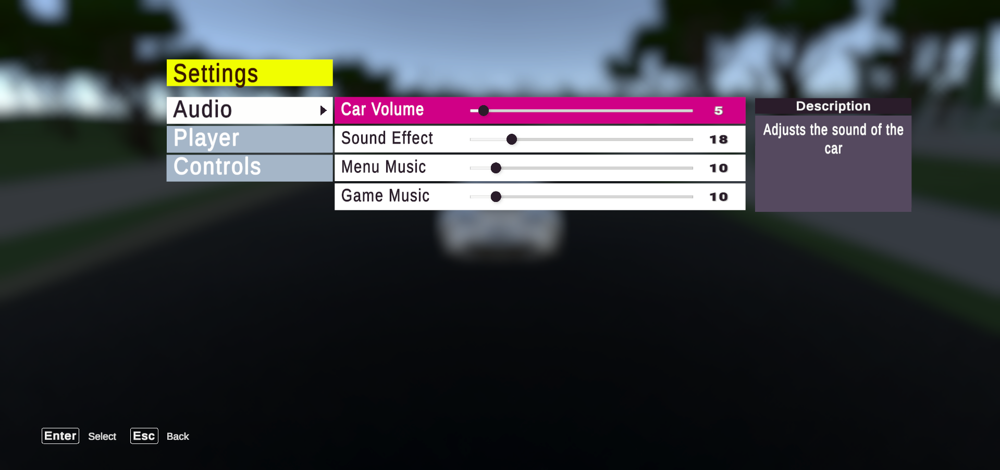
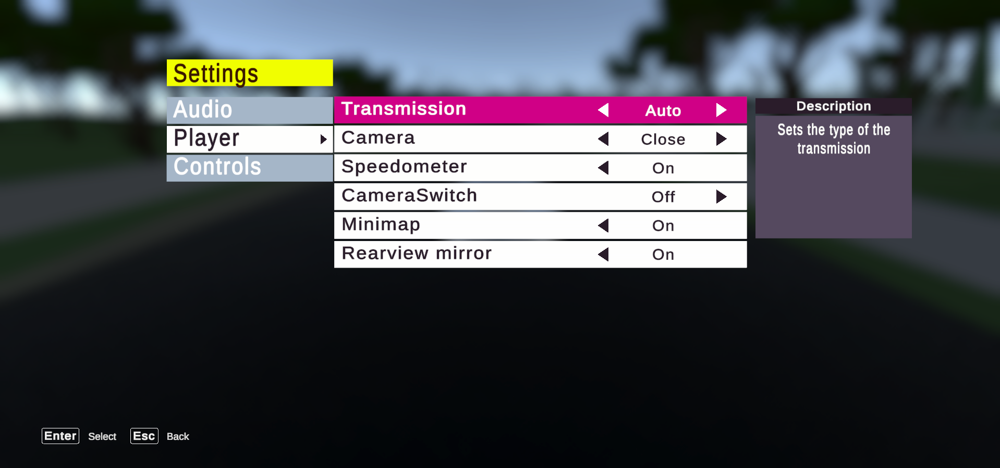
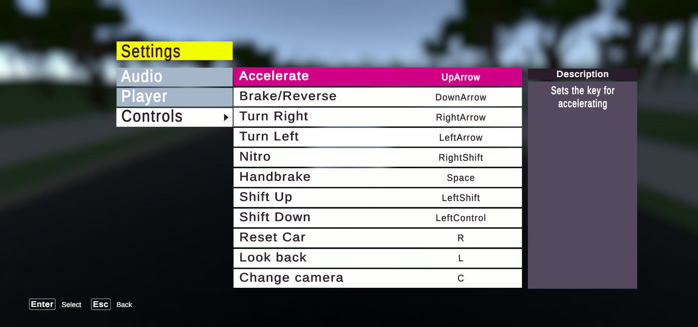
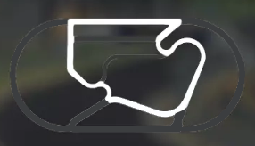
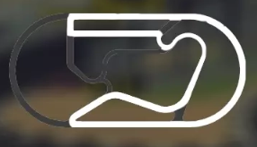
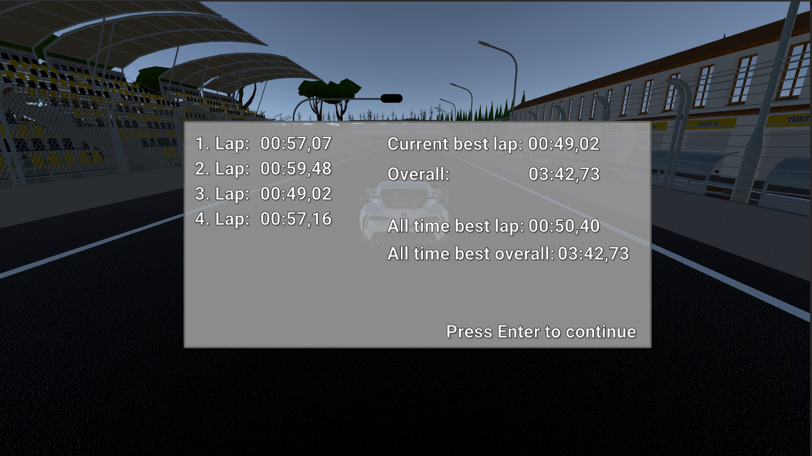
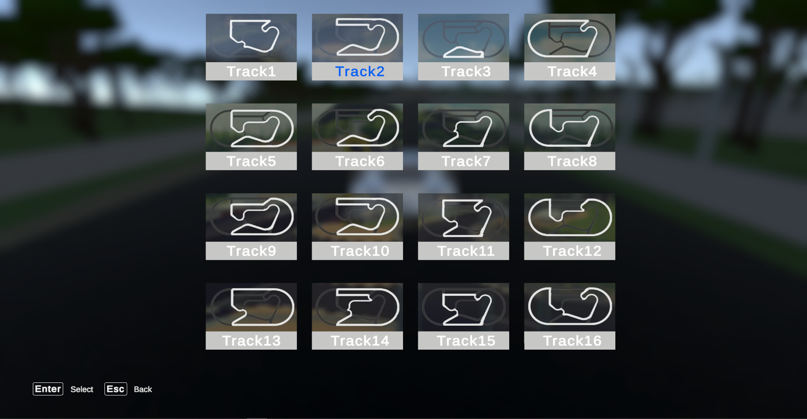

# Car Game in Unity
MyCar is an exhilarating [Unity](https://unity.com/)-based car racing game. Try it yourself for driving around the map or race against the time on different tracks.

## 🎮 Assets
You can download the required assets from [Download Assets](https://drive.google.com/drive/folders/1Z34yM3h9uFAumyWXoSF9ablwVo-di7rp?usp=drive_link).

Unzip the downloaded zip file and copy its contents into the "Assets" folder.

## 🚀 How to Run Unity project
After you downloaded assets, you should load the "Track" scene to race and explore the track.

## ⚙️ Settings
You can configure these settings within the in-game menu, and they are saved within the game.
- Keybindings for controls
- Sound
- Camera
- Gear shift

In the 🔊 sound settings, you can adjust the sound of the car, menu effects,menu and game music too.

In the 📷 camera settings, the "close", "far", "bumper", "hood" and "inside" options are functional.

An optional rear view mirror is in the game, which can be used in all camera settings except "Inside".

 | 
:-----------------------------------:|:------------------------------------:
Audio Settings                            | Player Settings

Controls Settings                          

## 🏁 Race Tracks
Currently, these tracks are available, and the game saves your best lap times.

 | 
:-----------------------------------:|:------------------------------------:
First Map                            | Second Map

End race:

But other track may come to the game:

## ⬇️ Download the Game
You can download the .exe version of the game from [Download the Game](https://drive.google.com/drive/folders/11VRT0yN6IS5HW7ZBRlp8eMPFdEScizlN?usp=drive_link).
